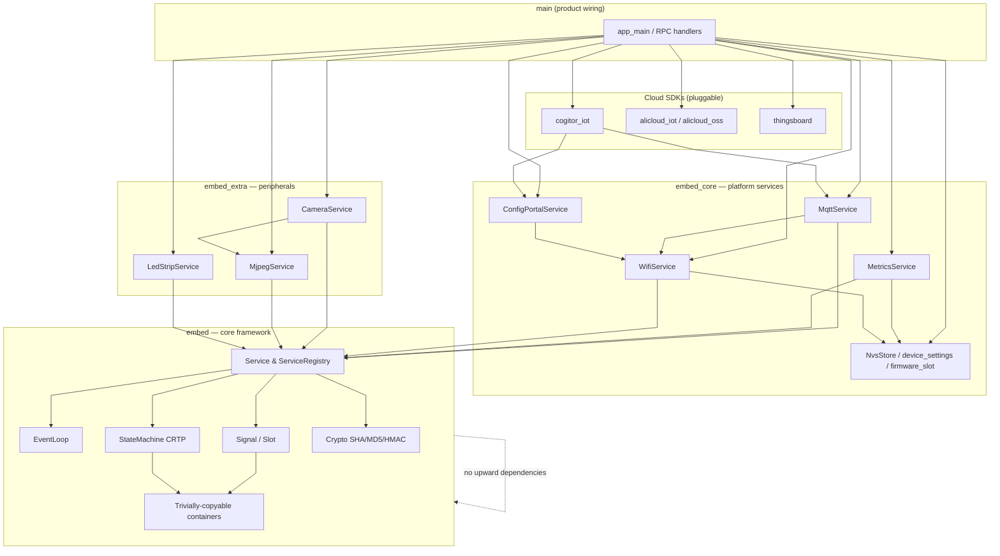
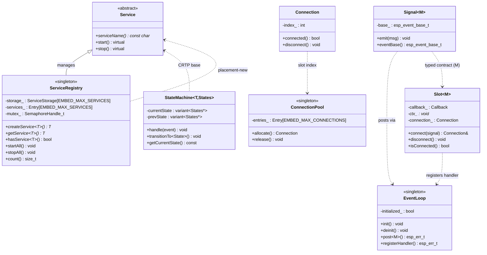
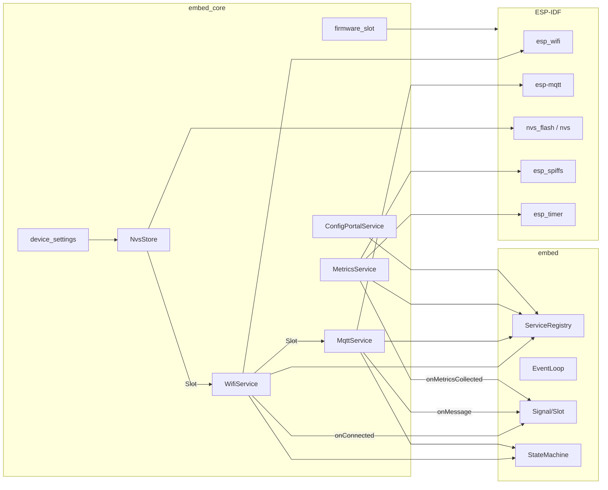
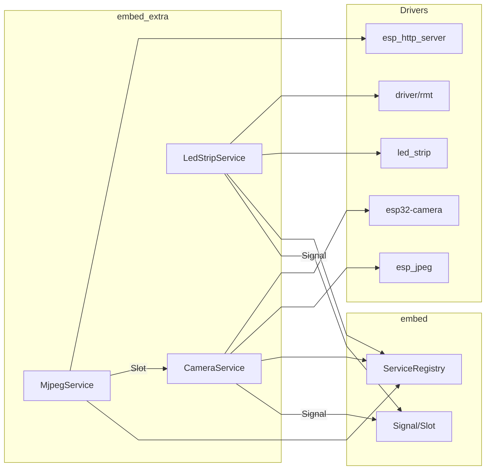
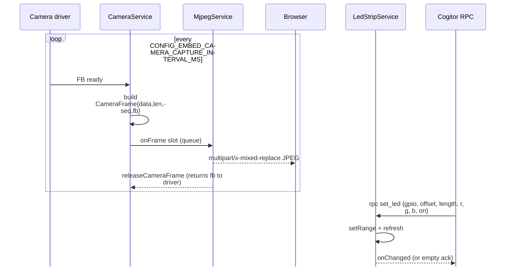
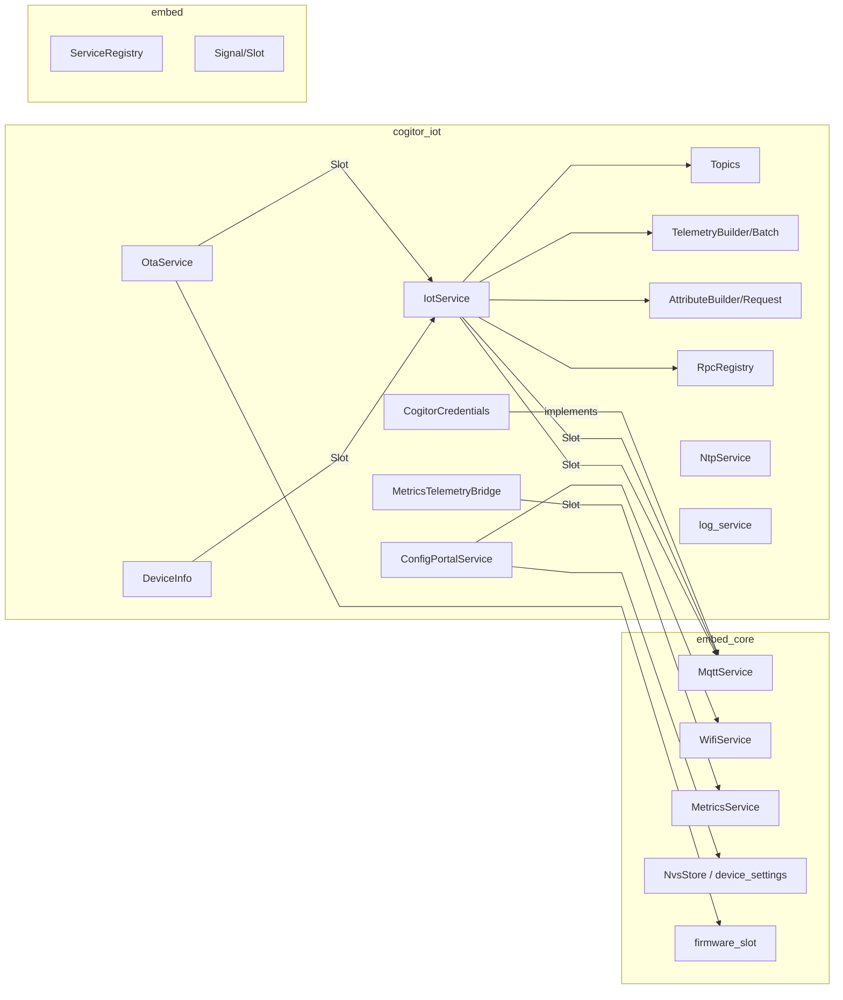
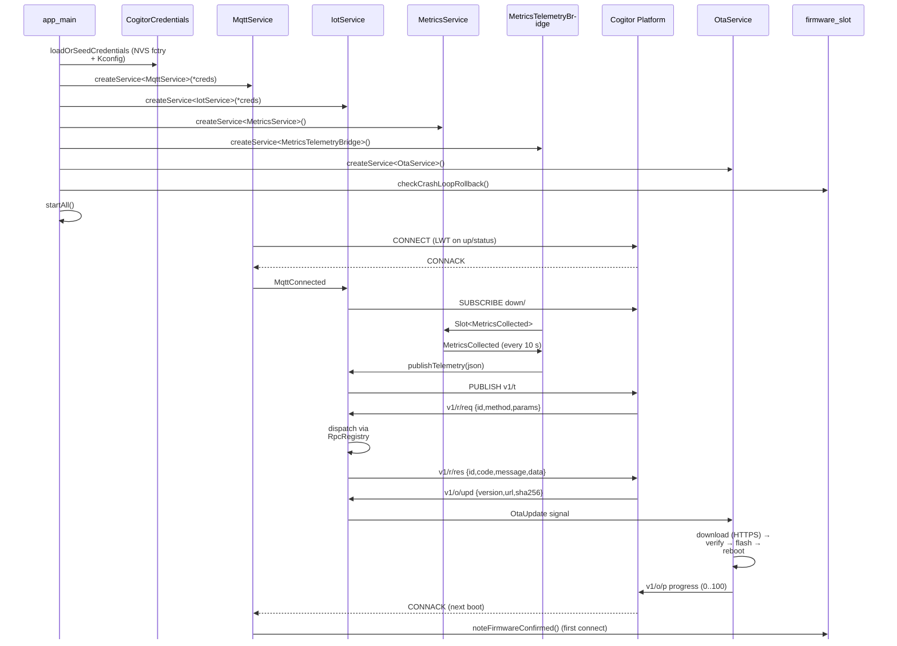

# Product Requirements Document — embed-framework

> **Document version:** 1.0  
> **Status:** Draft for review  
> **Target audience:** Solutions architects, embedded firmware engineers, IoT platform owners, QA  
> **Components in scope:** `embed`, `embed_core`, `embed_extra`, `cogitor_iot` (a.k.a. *Cogitor IoT device SDK*)

---

## Master Table of Contents

- [1. Document Overview](#1-document-overview)
  - [1.1 Purpose](#11-purpose)
  - [1.2 Scope and Boundaries](#12-scope-and-boundaries)
  - [1.3 Component Dependency Layering](#13-component-dependency-layering)
- [2. Component — `embed`](#2-component--embed)
  - [2.1 Overview & Scope](#21-overview--scope)
  - [2.2 Architecture & Interdependencies](#22-architecture--interdependencies)
  - [2.3 Functional Requirements](#23-functional-requirements)
  - [2.4 Non-Functional Requirements](#24-non-functional-requirements)
  - [2.5 Data Flow & Edge Integration](#25-data-flow--edge-integration)
- [3. Component — `embed_core`](#3-component--embed_core)
  - [3.1 Overview & Scope](#31-overview--scope)
  - [3.2 Architecture & Interdependencies](#32-architecture--interdependencies)
  - [3.3 Functional Requirements](#33-functional-requirements)
  - [3.4 Non-Functional Requirements](#34-non-functional-requirements)
  - [3.5 Data Flow & Edge Integration](#35-data-flow--edge-integration)
- [4. Component — `embed_extra`](#4-component--embed_extra)
  - [4.1 Overview & Scope](#41-overview--scope)
  - [4.2 Architecture & Interdependencies](#42-architecture--interdependencies)
  - [4.3 Functional Requirements](#43-functional-requirements)
  - [4.4 Non-Functional Requirements](#44-non-functional-requirements)
  - [4.5 Data Flow & Edge Integration](#45-data-flow--edge-integration)
- [5. Component — `cogitor_iot`](#5-component--cogitor_iot)
  - [5.1 Overview & Scope](#51-overview--scope)
  - [5.2 Architecture & Interdependencies](#52-architecture--interdependencies)
  - [5.3 Functional Requirements](#53-functional-requirements)
  - [5.4 Non-Functional Requirements](#54-non-functional-requirements)
  - [5.5 Data Flow & Edge Integration](#55-data-flow--edge-integration)
- [6. Cross-Component Requirements](#6-cross-component-requirements)
- [7. Release & Compliance](#7-release--compliance)

[↑ Back to Top](#product-requirements-document--embed-framework)

---

## 1. Document Overview

### 1.1 Purpose

This PRD specifies the functional, non-functional, and integration requirements for the **embed-framework** — a C++20, service-oriented embedded framework for ESP32-class devices running ESP-IDF 5.x. It is the authoritative reference for engineers implementing or extending the framework, for QA authoring acceptance tests, and for product owners planning releases. The four components documented here are the only first-party blocks the framework guarantees to ship and support.

### 1.2 Scope and Boundaries

| In Scope | Out of Scope |
|----------|--------------|
| Service registry, event loop, signal/slot, CRTP state machine, fixed-size POD containers | Cloud-side platform code (the `iot-platform-go` backend is a sibling project) |
| WiFi STA + SoftAP, MQTT client, persistent settings, metrics | Other cloud SDKs (`alicloud_*`, `thingsboard`) — they are plug-ins that follow the same contract documented here, but are not part of this PRD |
| Camera capture, MJPEG streaming, WS2812 LED strip | Hardware-specific board ports beyond what `Kconfig.projbuild` exposes |
| Cogitor IoT device SDK (protocol v1): telemetry, attributes, RPC, NTP, OTA, events, logs | Network topology, RabbitMQ broker configuration (covered by `deploy/`) |
| Test apps, host unit tests, IDF Docker toolchain | Mobile/desktop clients |

### 1.3 Component Dependency Layering



**Direction rule:** Dependencies flow **downward only**. Cloud provider components implement `embed::MqttCredentials` and consume `MqttService` signals; they must never be required by `embed` itself. This is enforced at the include level (CMake `idf_component.yml` REQUIRES lists).

[↑ Back to Top](#product-requirements-document--embed-framework)

---

## 2. Component — `embed`

### 2.1 Overview & Scope

The `embed` component is the **zero-dep core** of the framework. It defines the *vocabulary* every other component speaks: services, signals, slots, messages, state transitions, and trivially-copyable containers. It depends on ESP-IDF only for `esp_event`, `freertos`, and `mbedtls` (crypto); it must not depend on `embed_core`, `embed_extra`, or any cloud SDK.

**Key boundaries:**

- **In:** service lifecycle, registry, event loop, typed pub/sub, CRTP state machine, fixed-size POD containers, SHA-256 / MD5 / HMAC primitives.
- **Out:** WiFi, MQTT, HTTP, NVS, camera, LED drivers, any cloud protocol.

### 2.2 Architecture & Interdependencies



**Interaction contract:** `Signal<M>` and `Slot<M>` are parameterised on a single message type `M`. The framework guarantees that one `M`-typed `Signal` can be wired to many `Slot<M>` instances and that payloads cross the queue as raw byte copies (no serialization, no dynamic allocation).

### 2.3 Functional Requirements

| ID | Requirement |
|----|-------------|
| **F-EMB-001** | The registry MUST support creating up to `EMBED_MAX_SERVICES` (default 16) services, each up to `EMBED_SERVICE_SIZE` (default 512) bytes, with **zero heap allocation** (placement-new into static storage). |
| **F-EMB-002** | `createService<T>()` MUST be idempotent: a second call for the same `T` returns the existing instance. |
| **F-EMB-003** | `startAll()` MUST invoke `start()` in creation order; `stopAll()` MUST invoke `stop()` in reverse creation order. |
| **F-EMB-004** | The framework MUST define a `Message` concept: `std::is_trivially_copyable_v<T> && std::is_standard_layout_v<T> && sizeof(T) <= EMBED_MAX_EVENT_DATA_SIZE` (default 1600 B). |
| **F-EMB-005** | `Signal<M>::emit` MUST post through the event loop with a bounded timeout (`EMBED_EVENT_POST_TIMEOUT_MS`, default 100 ms). On queue-full, it MUST log and drop, never block forever. |
| **F-EMB-006** | `Slot<M>::connect` MUST register a unique `esp_event_handler_instance_t` so that the same callback can be registered multiple times for the same base/id without ambiguity. |
| **F-EMB-007** | `Slot<M>` MUST auto-disconnect on destruction (RAII via the internal `Connection`). |
| **F-EMB-008** | The `ConnectionPool` MUST be a singleton with capacity `EMBED_MAX_CONNECTIONS` (default 64), protected by a mutex when `EMBED_THREAD_SAFE=1`. |
| **F-EMB-009** | `StateMachine<T, States...>` MUST dispatch events only to the current state, call `onStateChanged` on the derived class with the transition result, and return `Nothing` for unhandled events. |
| **F-EMB-010** | `embed::string<N>` MUST be a fixed-capacity, null-terminated, trivially-copyable string that supports `std::string`, `std::string_view`, and `const char*` sources and silently truncates overflow. |
| **F-EMB-011** | `embed::array<T,N>`, `embed::optional<T>`, `embed::variant<Types...>`, `embed::pair<A,B>`, and `embed::tuple<Types...>` MUST all be `static_assert`ed trivially copyable. |
| **F-EMB-012** | `embed::crypto::sha256` (one-shot and incremental), `embed::crypto::hmacSha256`, and `embed::crypto::Md5` MUST be available with the same API on IDF 5 (legacy mbedtls) and IDF 6 (PSA). |
| **F-EMB-013** | All limits (`EMBED_MAX_SERVICES`, `EMBED_MAX_CONNECTIONS`, `EMBED_MAX_EVENT_DATA_SIZE`, `EMBED_SERVICE_SIZE`, `EMBED_MAX_CUSTOM_METRICS`, `EMBED_EVENT_POST_TIMEOUT_MS`, `EMBED_THREAD_SAFE`) MUST be overridable via `target_compile_definitions`. |

### 2.4 Non-Functional Requirements

| ID | Requirement | Target |
|----|-------------|--------|
| **NF-EMB-001** | **Memory (static):** Framework primitives add ≤ 4 KB to `.bss` for the default pool sizes (16 services × 512 B + 64 connections × 24 B + task stack 8 KB). | Verified at link map. |
| **NF-EMB-002** | **Memory (heap):** Steady-state heap usage is **zero** (no allocations after `init()`). | Unit test `test_embed_primitives` asserts. |
| **NF-EMB-003** | **Latency:** `Signal::emit → Slot callback` round-trip MUST be ≤ 1 ms at 240 MHz when the event queue is non-full. | Benchmarked in `test_apps/embed_unity`. |
| **NF-EMB-004** | **Thread safety:** With `EMBED_THREAD_SAFE=1` (default), all registry / pool / event-loop APIs MUST be safe to call from any FreeRTOS task. With `EMBED_THREAD_SAFE=0`, single-task call sites MUST be documented. | Code review + host test. |
| **NF-EMB-005** | **Determinism:** Message types MUST be POD; `static_assert(embed::Message<...>)` MUST fire at compile time for every service-defined message. | Build fails on regression. |
| **NF-EMB-006** | **Toolchain:** C++20 (`concepts`, `requires`, `constexpr if`), GCC 12+ (via ESP-IDF 5.5 toolchain), no exceptions, no RTTI for user types **except** in `getService<T>` (`dynamic_cast` requires RTTI enabled at link time). | CI builds. |
| **NF-EMB-007** | **Portability:** All headers compile under the host Linux GCC toolchain (no ESP-IDF symbols) for unit testing. | `host_test/CMakeLists.txt`. |
| **NF-EMB-008** | **Backwards compatibility:** Changing a public message struct is a **breaking change** and MUST bump a major version. | SemVer policy. |

### 2.5 Data Flow & Edge Integration

`embed` is an **in-process** bus. It does not touch the network boundary itself; it is the spine through which other components flow data. The edge integration points are:

```mermaid
%%{init: {
  "sequence": {
    "mirrorActors": false,
    "useMaxWidth": true,
    "wrap": true,
    "wrapPadding": 12
  }
}}%%
sequenceDiagram
    participant Producer as Producer task<br/>(e.g. MQTT worker)
    participant Loop as EventLoop<br/>(embed_evt task)
    participant Slot as Slot callback<br/>(Service::start)
    participant Consumer as Consumer state

    Producer->>Loop: esp_event_post(base, id, &msg, sizeof(M), 100ms)
    Note over Loop: enqueue or timeout
    Loop-->>Slot: dispatch on dedup'd task
    Slot->>Consumer: onStateChanged(TransitionTo<...>)  or direct call
    Consumer-->>Consumer: apply effect, may emit another Signal
```

**Edge integration:**

- **From WiFi/MQTT (C-level esp_event)** → `WifiService` / `MqttService` translate the IDF events into `embed::WifiConnected` / `MqttMessageReceived` signals on the `embed_evt` loop. This is the **only** place the framework bridges from IDF's `default_event_loop` to the `embed_evt` loop.
- **Slot handlers must be short** (≤ tens of microseconds for non-blocking work; longer work dispatches to a dedicated task). The default `EMBED_EVENT_TASK_STACK_SIZE` is **8192 bytes** because cJSON + RMT LED + RPC parsing do not fit in 4 KB.
- **Backpressure:** When the `embed_evt` queue is full, `Signal::emit` logs `ESP_LOGW` and **drops**. Producers MUST tolerate loss for non-critical paths; for critical paths, the producer MUST await an explicit ack signal (e.g. `MqttConnected`) before re-emitting.

[↑ Back to Top](#product-requirements-document--embed-framework)

---

## 3. Component — `embed_core`

### 3.1 Overview & Scope

`embed_core` provides the **platform services** every connected device needs: persistent settings, WiFi STA/SoftAP, MQTT client, periodic system metrics, OTA slot management, and (re-exported from `cogitor_iot`) a captive-portal config UI. It depends on `embed` for the registry/event-loop primitives and on ESP-IDF for `esp_wifi`, `esp_mqtt`, `nvs_flash`, `nvs`, `spi_flash`, `esp_spiffs`.

**Key boundaries:**

- **In:** `WifiService`, `MqttService`, `MetricsService`, `NvsStore`, `device_settings` (WiFi + portal flag + factory reset), `firmware_slot` (rollback + crash-loop guard), `ConfigPortalService` (re-exported from `cogitor_iot`).
- **Out:** Application-level cloud protocols (delegated to `cogitor_iot` / `alicloud_*` / `thingsboard`).

### 3.2 Architecture & Interdependencies



**State machines (CRTP, embed):**

- `WifiService`: `Idle → Scanning → Connecting → Connected ↔ Disconnected → Error` (retry, re-arm).
- `MqttService`: `Idle → Connecting → Connected ↔ Disconnected → Error` (driven by WiFi up/down).

### 3.3 Functional Requirements

| ID | Requirement |
|----|-------------|
| **F-EC-001** | `NvsStore::initFlash()` MUST open the default `nvs` partition and, if present, also the `fctry` partition. The `fctry` partition MUST NOT be in the default flash image set so that `idf.py flash` and OTA preserve device identity. |
| **F-EC-002** | `loadWifiSettings(out)` / `saveWifiSettings(in)` MUST read/write the `wifi` NVS namespace on the `fctry` partition when available, with Kconfig seed fallback. |
| **F-EC-003** | `WifiService::start()` MUST read SSID/password from NVS `fctry` first, then Kconfig `CONFIG_EMBED_WIFI_*`, then fall back to the SoftAP portal. |
| **F-EC-004** | `WifiService` MUST emit `embed::WifiConnected{ip: string<17>}` on the `embed_evt` loop after IP acquisition, and `embed::WifiDisconnected{reason: uint8_t}` when the link is lost. |
| **F-EC-005** | `WifiService::enableSoftAp()` MUST be callable **before** `start()` and MUST publish SSID `"{prefix}-{MAC4}{MAC5}"` (default `embed-A1B2`). |
| **F-EC-006** | `MqttService` MUST accept a `MqttCredentials&` (abstract base) that survives the service. It MUST support username/password auth, optional TLS via PEM CA cert, and an LWT (topic, payload, QoS, retain). |
| **F-EC-007** | `MqttService` MUST disable esp-mqtt's auto-reconnect and drive reconnects from its own state machine + `esp_timer`, with interval `CONFIG_EMBED_MQTT_RECONNECT_INTERVAL_MS` and max attempts `CONFIG_EMBED_MQTT_MAX_RETRY`. |
| **F-EC-008** | `MqttService::onMessage` MUST publish `MqttMessageReceived{topic: string<127>, payload: string<1400>}`. Payloads > 1400 B MUST be truncated and a warning logged. |
| **F-EC-009** | `MetricsService` MUST collect, every `CONFIG_EMBED_METRICS_INTERVAL_MS` (default 10 s): CPU load (when `FREERTOS_GENERATE_RUN_TIME_STATS=y`), free/min/largest heap, free/min/largest internal DRAM, total DRAM, free/min PSRAM, uptime, SPIFFS total/used (if mounted), WiFi RSSI/link/IP, and up to `EMBED_MAX_CUSTOM_METRICS` custom values. |
| **F-EC-010** | `MetricsService::registerCustomMetric(name, callback, ctx)` MUST return `false` if the name already exists or the registry is full. |
| **F-EC-011** | `ConfigPortalService` MUST serve an HTTP UI on the SoftAP IP (default `192.168.4.1`) and optionally on the STA IP (`CONFIG_EMBED_CONFIG_HTTP_STA`). The UI MUST allow editing WiFi + cloud credentials and rebooting. |
| **F-EC-012** | `setFactoryResetHandler(handler)` MUST allow cloud providers to override the default `factoryResetSettings()` wipe policy. The default MUST wipe active WiFi and set the portal flag, **keep** a `wifi_b` backup. |
| **F-EC-013** | `checkCrashLoopRollback()` MUST be called early in `app_main`. If the new OTA image has not been confirmed within N boots (or panic/WDT fired N times), it MUST `esp_ota_set_boot_partition` to the other slot and restart. |
| **F-EC-014** | `noteFirmwareConfirmed()` MUST be called when MQTT connects (or the app reaches its ready state). It MUST clear the pending-verify counter. |
| **F-EC-015** | `scheduleReboot(delayMs)` MUST be implemented as a one-shot `esp_timer` that calls `esp_restart`. |
| **F-EC-016** | `factoryResetGpioHeld()` and `checkRstBurstFactoryReset()` MUST allow BOOT-button hold and EN/RST burst as factory-reset triggers. |

### 3.4 Non-Functional Requirements

| ID | Requirement | Target |
|----|-------------|--------|
| **NF-EC-001** | **WiFi connect time** (cold, Kconfig seed, known SSID) | ≤ 6 s median on ESP32-S3. |
| **NF-EC-002** | **WiFi reconnect** (warm, transient loss) | ≤ 3 s. |
| **NF-EC-003** | **MQTT connect time** (after WiFi UP) | ≤ 2 s median. |
| **NF-EC-004** | **MQTT throughput (uplink)** | ≥ 200 msg/s on a 64-byte payload, QoS 0, no backpressure. |
| **NF-EC-005** | **NVS wear:** `device_settings` writes MUST commit in batches; no write loops > 10 commits/s. | Code review. |
| **NF-EC-006** | **Stack budget:** `WifiService`, `MqttService`, `MetricsService` objects MUST each fit in `EMBED_SERVICE_SIZE` (512 B) when constructed with default arguments. Large buffers (WiFi scan results) MUST live on the heap. | `static_assert` + bin size. |
| **NF-EC-007** | **Security:** All WiFi/MQTT credentials MUST live in NVS `fctry`, never in source. The factory-reset handler MUST clear them. | Code review. |
| **NF-EC-008** | **Portability:** All `embed_core` headers MUST remain header-only-or-impl-clean so they can be unit-tested on the host where possible. | `host_test/`. |

### 3.5 Data Flow & Edge Integration

```mermaid
%%{init: {
  "sequence": {
    "mirrorActors": false,
    "useMaxWidth": true,
    "wrap": true,
    "wrapPadding": 12
  }
}}%%
sequenceDiagram
    participant App as app_main
    participant SR as ServiceRegistry
    participant Wifi as WifiService
    participant MQTT as MqttService
    participant M as MetricsService
    participant NVS as NVS fctry
    participant Loop as embed_evt
    participant Net as WiFi / IP stack

    App->>NVS: NvsStore::initFlash()
    App->>Loop: EventLoop::instance().init()
    App->>SR: createService<WifiService>()
    App->>SR: createService<MetricsService>()
    App->>SR: createService<MqttService>(creds)
    App->>SR: startAll()
    SR->>Wifi: start() (load SSID, init WiFi)
    Wifi->>NVS: loadWifiSettings
    Wifi->>Net: esp_wifi_start()
    Net-->>Wifi: WIFI_EVENT_STA_CONNECTED / IP acquired
    Wifi->>Loop: emit WifiConnected{ip}
    Loop-->>MQTT: Slot onWifiConnected fires
    MQTT->>Net: esp_mqtt_client_start()
    Net-->>MQTT: MQTT_EVENT_CONNECTED
    MQTT->>Loop: emit MqttConnected{brokerUri}
    M->>Loop: emit MetricsCollected (every 10 s)
```

[↑ Back to Top](#product-requirements-document--embed-framework)

---

## 4. Component — `embed_extra`

### 4.1 Overview & Scope

`embed_extra` delivers **peripheral services** that are not on the critical path of every device: camera capture, MJPEG-over-HTTP streaming, and WS2812/SK6812 LED strips. All three integrate with the rest of the framework through the standard `Signal` / `Slot` contract, so other services can subscribe to frames, LED state changes, or any future peripheral without coupling to the driver.

**Key boundaries:**

- **In:** `CameraService`, `MjpegService`, `LedStripService`, Kconfig for board pinouts, frame-buffer count, capture interval, MJPEG port, LED strip count and default brightness.
- **Out:** Cloud uplinks (cameras stream to MJPEG clients; cloud upload is the responsibility of `alicloud_oss` or the application's own HTTP client).

### 4.2 Architecture & Interdependencies



**Ownership rule (camera):** When `CameraFrame.fb` is non-null, the frame is a **zero-copy view** of the camera driver's PSRAM buffer; the consumer MUST call `esp_camera_fb_return(fb)`. When `fb` is null, `data` is a heap buffer the consumer MUST `free()`. The `releaseCameraFrame(frame)` helper enforces this.

### 4.3 Functional Requirements

| ID | Requirement |
|----|-------------|
| **F-EX-001** | `CameraService` MUST initialize the camera using the pin set selected by `CONFIG_EMBED_CAMERA_BOARD` (`FREENOVE_S3` or `AITHINKER`) and capture JPEG frames at `CONFIG_EMBED_CAMERA_CAPTURE_INTERVAL_MS` (default 50 ms ≈ 20 fps). |
| **F-EX-002** | `CameraService::onFrame` MUST emit `CameraFrame{data, len, seq, fb}` on the `embed_evt` loop for every captured frame. The sequence number MUST be monotonically increasing per service instance. |
| **F-EX-003** | `releaseCameraFrame(frame)` MUST be a no-fail helper that calls `esp_camera_fb_return` when `fb != nullptr` or `free(data)` otherwise, then zeroes the struct. |
| **F-EX-004** | `MjpegService` MUST register a `GET /stream` HTTP handler that emits `multipart/x-mixed-replace` MJPEG using a configurable queue depth (`CONFIG_EMBED_MJPEG_QUEUE_DEPTH`, default 2) and HTTP server stack size (`CONFIG_EMBED_MJPEG_STACK_SIZE`, default 8 KB). |
| **F-EX-005** | `MjpegService` MUST gracefully drop frames when the HTTP client is slower than the producer (queue full → drop oldest). |
| **F-EX-006** | `LedStripService::attach(gpio, count, brightness=default)` MUST bind a logical strip to a GPIO at runtime. It MUST allocate an RMT TX channel and refuse to attach when the channel pool is exhausted (≤ `CONFIG_EMBED_LED_STRIP_MAX` strips, default 4). |
| **F-EX-007** | `LedStripService::setPixel` / `setRange` / `fill` / `clear` / `setBrightness` MUST update an in-memory shadow buffer. `refresh(gpio)` MUST push the buffer to the wire. `onChanged` MUST be emitted on every successful `refresh`. |
| **F-EX-008** | `LedStripService::detach` / `detachAll` MUST release the RMT channel and free the strip. |
| **F-EX-009** | All three services MUST participate in the `startAll()` / `stopAll()` lifecycle. |

### 4.4 Non-Functional Requirements

| ID | Requirement | Target |
|----|-------------|--------|
| **NF-EX-001** | **Camera steady-state latency** (frame ready → `onFrame` slot fires) | ≤ 2 ms at QQVGA/20 fps. |
| **NF-EX-002** | **MJPEG bandwidth:** Single HTTP client on LAN, VGA JPEG, 20 fps | ≥ 1.5 MB/s sustained, no dropped frames after warmup. |
| **NF-EX-003** | **Camera memory budget:** Default config (FB_COUNT=2, QVGA JPEG) MUST fit in ≤ 320 KB PSRAM. | Partition table + link map. |
| **NF-EX-004** | **LED update rate:** `setPixel + refresh` on a 144-LED strip MUST complete in ≤ 30 ms. | Bench. |
| **NF-EX-005** | **RMT contention:** `CONFIG_EMBED_LED_STRIP_MAX` MUST be ≤ the number of RMT TX channels on the target (ESP32-S3: 4). | Kconfig range check. |
| **NF-EX-006** | **Stack budget:** `CameraService`, `MjpegService`, `LedStripService` objects MUST each fit in `EMBED_SERVICE_SIZE` (default 512 B). Long-lived buffers (camera FB, HTTP task stack) live outside the registry. | `static_assert`. |
| **NF-EX-007** | **Power:** When the application does not need camera, `embed_extra` MUST not pull `esp_camera` into the link map. | Component-level opt-in. |

### 4.5 Data Flow & Edge Integration



[↑ Back to Top](#product-requirements-document--embed-framework)

---

## 5. Component — `cogitor_iot`

### 5.1 Overview & Scope

`cogitor_iot` is the **device SDK for the Cogitor IoT Platform** (protocol **v1**). It implements the full MQTT contract — credentials, topic builders, telemetry, events, attributes (reported + desired), RPC, NTP, OTA, device info, logs, metrics bridge, and a captive config portal — and exposes them as `embed::Service` instances and `embed::Signal`s. It depends on `embed` and `embed_core`; it does not require any other cloud SDK.

**Note on naming:** The legacy name `copilot_iot` is deprecated and refers to the same component (`cogitor_iot`). All new code MUST use `cogitor_iot`.

**Key boundaries:**

- **In:** `CogitorCredentials` (access-token or basic auth, LWT), `loadOrSeedCredentials()` (NVS `fctry` + Kconfig seed), `Topics` (Short / Full), `IotService` (subscribe downstream + dispatch), `TelemetryBuilder` / `TelemetryBatch`, `AttributeBuilder` / `AttributeRequestBuilder`, `RpcRegistry` (built-in `rpc-list`), `OtaService` (HTTPS + MQTT-stream), `NtpService`, `ConfigPortalService`, `DeviceInfo`, `MetricsTelemetryBridge`, `log_service`.
- **Out:** Backend server code (in `iot-platform-go`).

### 5.2 Architecture & Interdependencies



**Signal surface (`IotService`):**

| Signal | Trigger | Payload |
|--------|---------|---------|
| `onAttributeUpdate` | Platform pushes desired attrs (`v1/a/upd`) | `AttributeUpdate{ payload: string<767> }` |
| `onAttributeResponse` | Platform answers attribute request | `AttributeResponse{ requestId, payload }` |
| `onRpcRequest` | Platform invokes RPC | `RpcRequest{ requestId, method, params }` |
| `onNtpResponse` | Platform answers NTP | `NtpResponse{ requestId, deviceSendTime, serverRecvTime, serverSendTime }` |
| `onOtaUpdate` | Platform pushes OTA notification | `OtaUpdate{ payload: string<1400> }` |
| `onOtaCancel` | Platform cancels OTA | `OtaCancel{ payload: string<255> }` |

### 5.3 Functional Requirements

| ID | Requirement |
|----|-------------|
| **F-CG-001** | `CogitorCredentials` MUST implement `embed::MqttCredentials` and expose access-token auth (`{product_id}.{device_id}` as `username` and `client_id`, access token as `password`) **or** explicit basic auth via `createBasic()`. |
| **F-CG-002** | `CogitorCredentials` MUST register a retained LWT on the status topic (`v1/s` or `…/up/status`) with payload `{"online":false,"ts":0,"reason":"lwt"}`, QoS 1. |
| **F-CG-003** | `loadOrSeedCredentials(product, device, host, token, style, useTls, port)` MUST (a) load from NVS `fctry` ns `cogitor` if complete, otherwise (b) seed from Kconfig, persist, and return. It MUST NOT hard-code the access token in source. |
| **F-CG-004** | `Topics` MUST support both `TopicStyle::Short` (`v1/t`, `v1/a`, `v1/r/req`, …) and `TopicStyle::Full` (`iot/v1/{product}/{device}/up|down/...`). The two MUST share the same payloads. |
| **F-CG-005** | `IotService::start` MUST subscribe to the device's downstream set on `MqttConnected`. On `MqttDisconnected` it MUST clear its subscription state. |
| **F-CG-006** | `TelemetryBuilder` MUST produce all three forms: simple KV, single-timestamped (`{"ts":...,"values":{...}}`), and batched JSON array. It MUST support `double`, `int64_t`, `int`, `bool`, `const char*`, `std::string_view`, and raw JSON insertion. |
| **F-CG-007** | `AttributeBuilder` MUST produce flat JSON for reported attributes. `AttributeRequestBuilder` MUST produce `{"id":...,"reported":[...],"desired":[...]}` and `addReported` / `addDesired` MUST de-duplicate keys; `reportedAll()` / `desiredAll()` MUST emit `["*"]`. |
| **F-CG-008** | `RpcRegistry::add(method, params, handler, ctx, desc)` MUST refuse to add beyond `kMaxMethods` (24). Unknown method on dispatch MUST be reported as `code: 404` to the platform. |
| **F-CG-009** | `RpcRegistry` MUST implement the built-in `rpc-list` method, returning a JSON array of `{ method, params, required, description? }` for every registered method (including itself). |
| **F-CG-010** | `IotService::requestNtp` MUST publish `{"id":<req>,"deviceSendTime":<ms>}` to the NTP request topic and emit `NtpResponse` on the corresponding downstream topic. |
| **F-CG-011** | `OtaService` MUST parse the OTA JSON (`version`, `module`, `size`, `url` or `stream:"mqtt"`, `sha256`, optional `sign` / `signMethod`, optional `force`). It MUST run the download + verify + flash on a **dedicated FreeRTOS task**, not the `embed_evt` loop. |
| **F-CG-012** | `OtaService` MUST report progress on `v1/o/p` (or `…/up/ota/progress`) with step codes 0–100, 101 success, -1 download fail, -2 checksum/sig fail, -3 flash fail, -4 cancelled. |
| **F-CG-013** | `OtaService` MUST verify SHA-256 (and signature when present) before flashing. After flashing, it MUST reboot; on first successful MQTT connect the framework MUST call `noteFirmwareConfirmed()` to clear the pending-verify counter. |
| **F-CG-014** | `OtaService` MUST honour `OtaCancel` messages from the platform, aborting the in-flight download or flash. |
| **F-CG-015** | `ConfigPortalService` MUST provide both SoftAP (`http://192.168.4.1/`) and (when `CONFIG_EMBED_CONFIG_HTTP_STA=y`) STA HTTP endpoints, exposing WiFi + cloud settings, JSON import/export, and factory-reset. Saving MUST write `fctry` and reboot. |
| **F-CG-016** | `DeviceInfo` MUST publish static reported attributes (firmware version, chip model, free heap, WiFi MAC, …) on each `MqttConnected` and request all desired attributes. |
| **F-CG-017** | `MetricsTelemetryBridge` MUST subscribe to `MetricsService::onMetricsCollected` and republish as a Cogitor telemetry JSON. |
| **F-CG-018** | All publish / subscribe / RPC interactions MUST put correlation `id` in the **JSON body**, never in the topic path. |

### 5.4 Non-Functional Requirements

| ID | Requirement | Target |
|----|-------------|--------|
| **NF-CG-001** | **Subscribe round-trip:** First `MqttConnected` → all downstream subs registered | ≤ 200 ms. |
| **NF-CG-002** | **Telemetry publish latency:** `publishTelemetry(json)` → broker PUBREC | ≤ 50 ms (LAN, QoS 1). |
| **NF-CG-003** | **RPC round-trip:** Platform RPC → handler invocation → response published | ≤ 30 s default timeout (per spec). |
| **NF-CG-004** | **OTA throughput:** HTTPS download of a 1 MB image to PSRAM | ≥ 100 KB/s sustained on typical home WiFi. |
| **NF-CG-005** | **OTA safety:** Crash-loop guard MUST trigger on N consecutive unconfirmed boots (default 3). | `firmware_slot`. |
| **NF-CG-006** | **Topic-string budget:** Short-style strings in flash | ≤ 1.2 KB (compile-time constant pool). |
| **NF-CG-007** | **Stack budget:** `IotService` MUST fit in `EMBED_SERVICE_SIZE` (512 B) by holding only pointers (`MqttService*`, `Topics`, `RpcRegistry*`); long-lived JSON lives on the heap. | `static_assert` + bin size. |
| **NF-CG-008** | **Security:** Access token MUST live in NVS `fctry`, never in source or telemetry. | Code review + scanner. |
| **NF-CG-009** | **Backwards compatibility:** Any new topic leaf or new JSON field is **non-breaking** if it can be ignored by old brokers; removal is breaking and requires a major protocol bump (`v2`). | SemVer on `topic_str` table. |
| **NF-CG-010** | **Determinism:** RPC handlers run on the `embed_evt` task and MUST complete fast. Long work (OTA, flash) MUST hop to a dedicated task. | Code review. |

### 5.5 Data Flow & Edge Integration



[↑ Back to Top](#product-requirements-document--embed-framework)

---

## 6. Cross-Component Requirements

| ID | Requirement |
|----|-------------|
| **CX-001** | All cross-service messages MUST be `embed::Message` and `static_assert`ed at the point of definition. |
| **CX-002** | Slot handlers MUST NOT block. Long work MUST be deferred to a dedicated FreeRTOS task (OTA, HTTPS, flash, camera encoding). |
| **CX-003** | NVS `fctry` is the **single source of truth** for runtime-mutable identity (WiFi creds, cloud token, product/device IDs). It MUST survive `idf.py flash` and OTA. |
| **CX-004** | `sdkconfig` (local) seeds `fctry` on first boot **only**. After a config-portal save or a factory reset, the seed MUST be re-applied only if no NVS entry exists. |
| **CX-005** | Factory reset is the **only** operation allowed to clear `fctry`. It MUST require either a GPIO hold (`CONFIG_EMBED_CONFIG_RESET_GPIO`), an EN/RST burst (`CONFIG_EMBED_CONFIG_RST_BURST_COUNT`), the config portal, or an explicit `factoryResetSettings()` call. |
| **CX-006** | All components MUST build green on the project's CI matrix: (a) host unit tests (Linux GCC), (b) `test_apps/embed_unity` (IDF Docker), (c) firmware build (IDF Docker). |
| **CX-007** | All public headers MUST be guarded with `#pragma once` and a service-specific header guard prefix (e.g. `EMBED_REGISTRY_HPP`). |
| **CX-008** | All service class names MUST end in `Service` and live in `namespace embed` (or `cogitor::iot` for the Cogitor SDK). |

[↑ Back to Top](#product-requirements-document--embed-framework)

---

## 7. Release & Compliance

| ID | Requirement |
|----|-------------|
| **RC-001** | Versioning follows **Semantic Versioning** (`MAJOR.MINOR.PATCH`). Breaking API or message changes require a `MAJOR` bump. |
| **RC-002** | Each release MUST publish: API changelog, Kconfig delta, link-map size delta (target `firmware.bin` size, RAM, PSRAM), CI artifact binaries. |
| **RC-003** | Releases MUST be tagged and signed; OTA artifacts MUST include a SHA-256 manifest and an RSA signature field (`sign` / `signMethod`). |
| **RC-004** | The CI pipeline at `.gitea/workflows/ci.yml` MUST be green on `master` before any release tag. |
| **RC-005** | The docs in `docs/` (architecture, manual, MQTT spec, OTA, testing, CI) MUST be kept in sync with the implementation; PRs that change a public API MUST touch the corresponding doc. |

[↑ Back to Top](#product-requirements-document--embed-framework)
