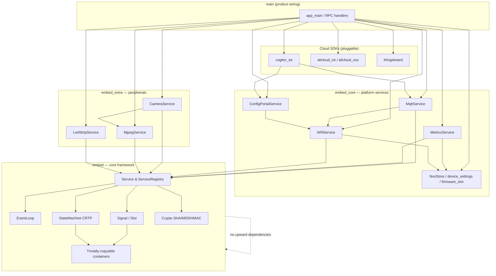
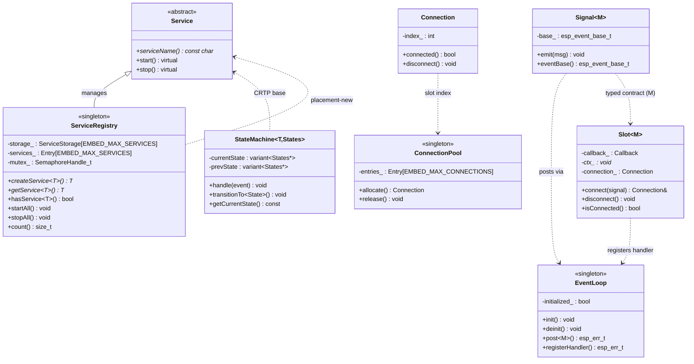
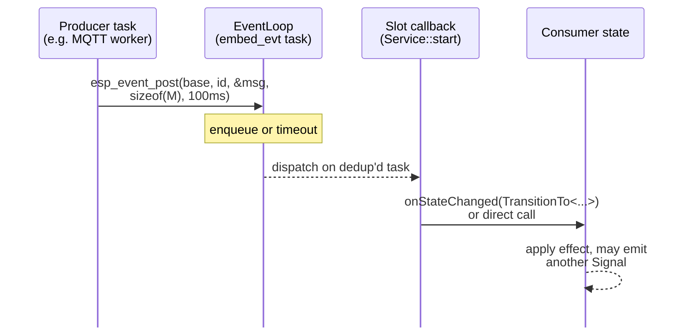
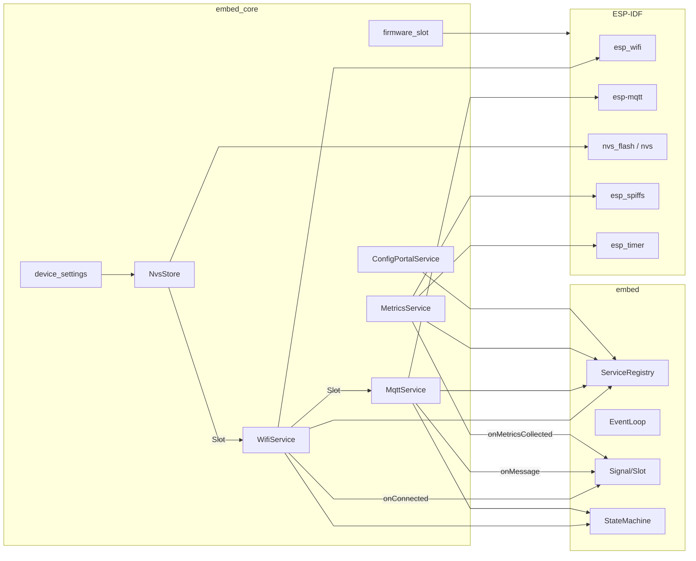
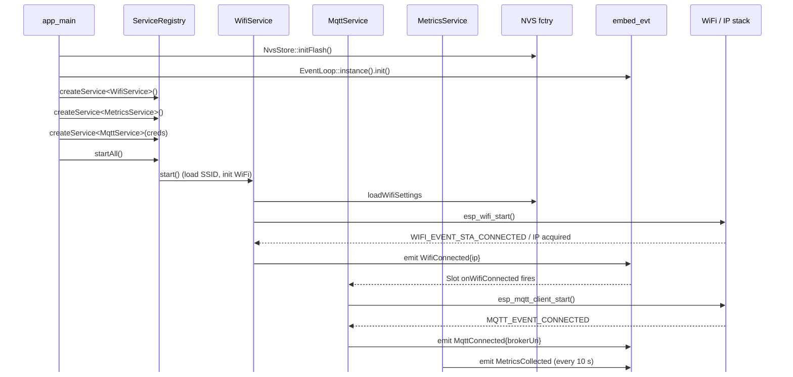
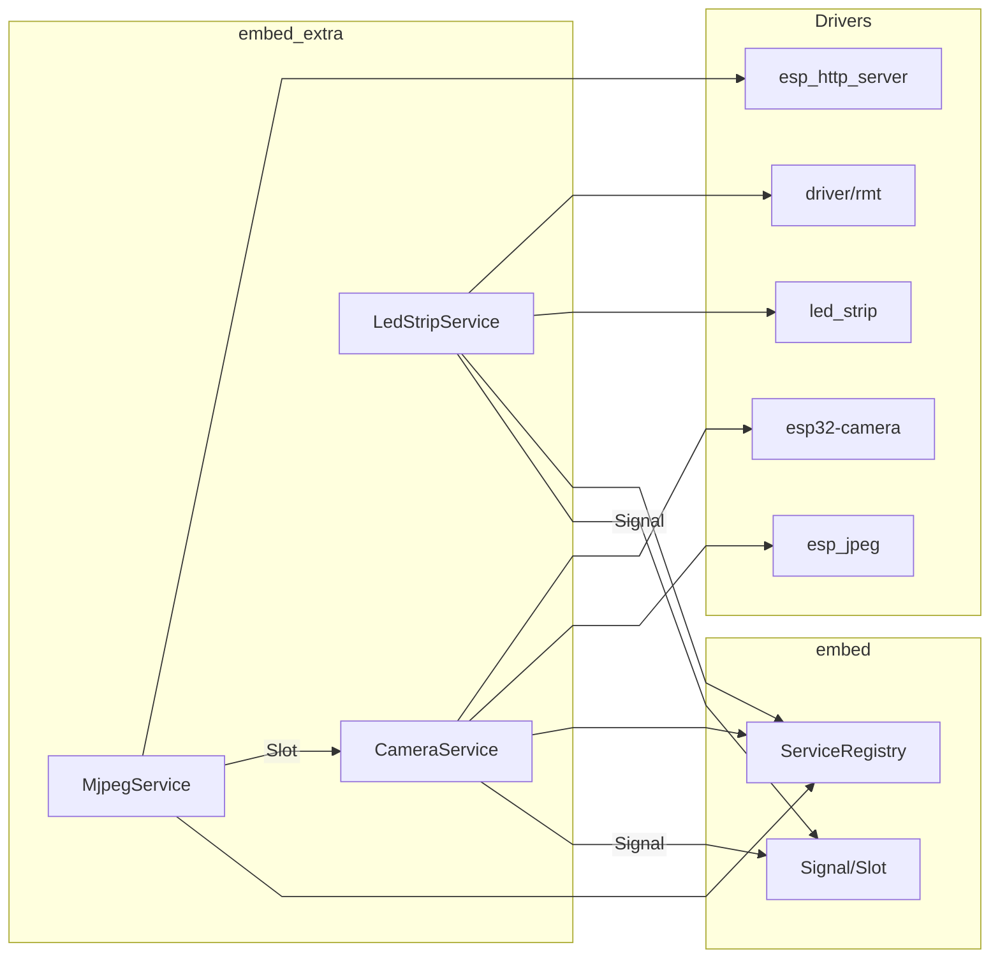
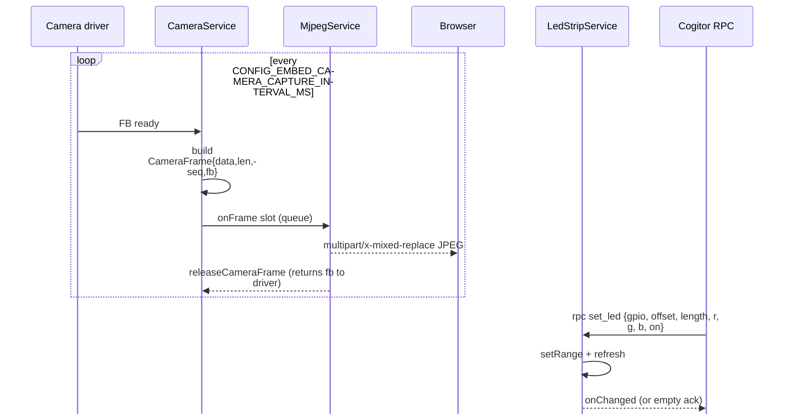
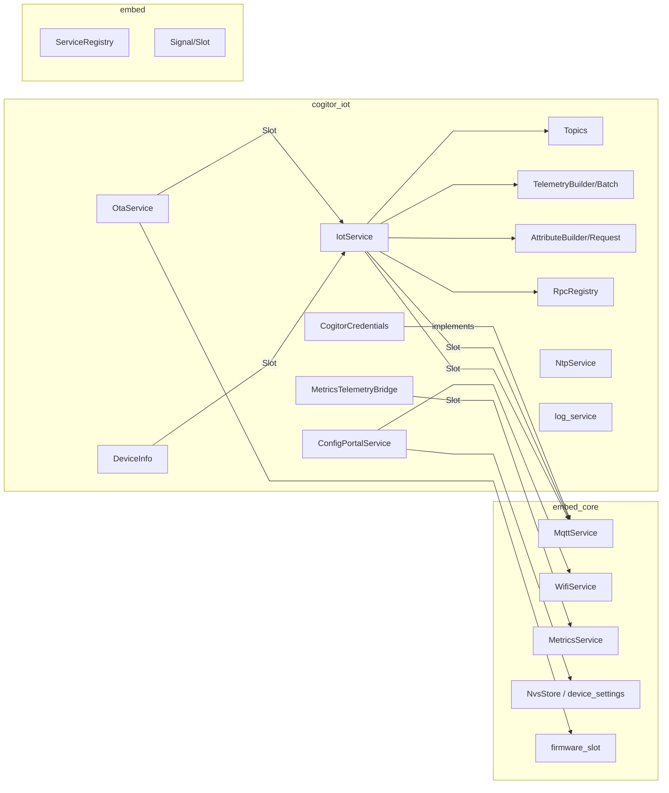
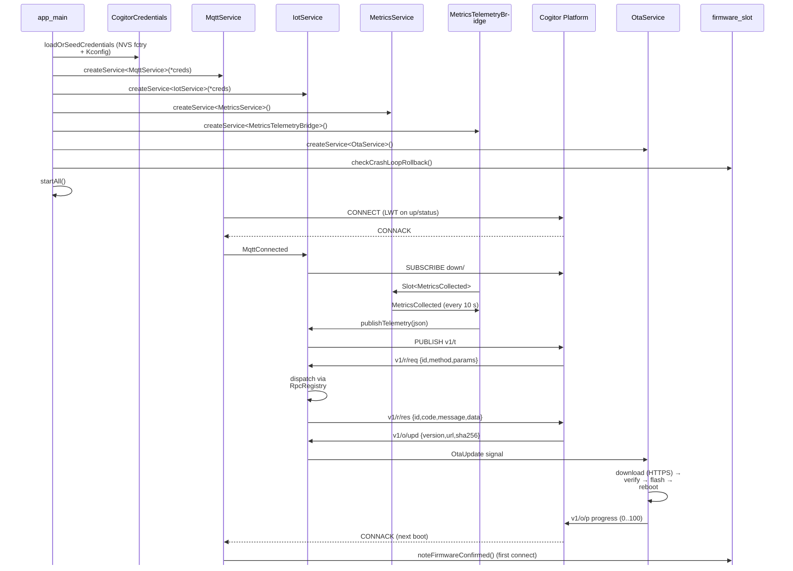

# PRD Diagrams — embed-framework

> Extracted from [prd.md](prd.md). Each diagram is self-contained and can be rendered by any Mermaid-compatible viewer.

---

# Component Dependency Layering

Full framework component hierarchy — from application wiring down through cloud SDKs, peripheral services, platform services, to the core framework primitives. Dependencies flow downward only.

---

# embed — Class Diagram

Core framework class relationships: Service, ServiceRegistry, EventLoop, Signal/Slot, ConnectionPool, StateMachine, and their interactions.

---

# embed — Data Flow

In-process event bus: how messages flow from a producer task through the EventLoop to Slot callbacks and consumer state.

---

# embed_core — Architecture

Platform services (WiFi, MQTT, Metrics, NVS, ConfigPortal) and their dependencies on embed primitives and ESP-IDF drivers.

---

# embed_core — Startup & Data Flow

Application startup sequence: NVS init, EventLoop init, service creation, WiFi connect, MQTT connect, metrics collection.

---

# embed_extra — Architecture

Peripheral services (Camera, MJPEG, LED strip) and their dependencies on ESP-IDF drivers and the core framework.

---

# embed_extra — Camera & LED Data Flow

Camera capture loop (frame buffer → MJPEG stream) and LED strip RPC control flow.

---

# cogitor_iot — Architecture

Cogitor IoT Platform SDK internals: credentials, topics, IotService, telemetry, attributes, RPC, OTA, NTP, device info, metrics bridge, and config portal.

---

# cogitor_iot — Full Data Flow

End-to-end flow: credentials loading, service creation, MQTT connect, telemetry publish, RPC dispatch, OTA update with crash-loop guard.

